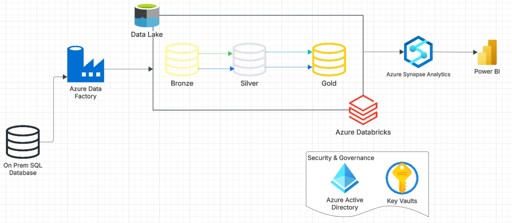
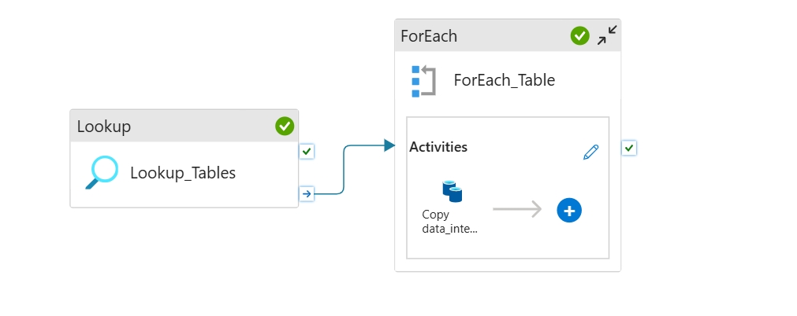
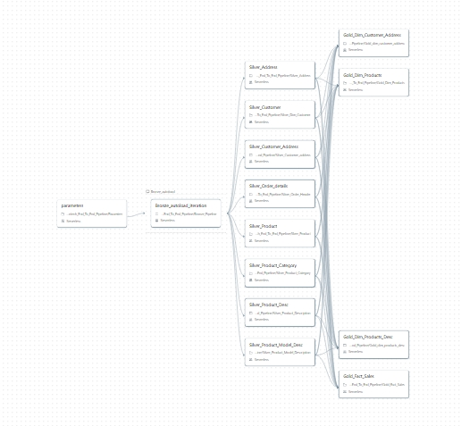

# AdventureWorksLT-Data-Lakehouse-Architecture-ETE-Pipeline

A modern, scalable Data Lakehouse platform built on the Medallion Architecture, integrating data from an on-premises SQL database using  Azure Data Factory (ADF), Azure Data Lake Storage (ADLS Gen2), Azure Databricks (PySpark/Delta Lake), and Azure Synapse Analytics.

This project orchestrates the ingestion, transformation, and optimization of relational ERP data from an on-premises SQL Server environment into high-performance, analytical Star Schemas ready for business intelligence.

## Prerequisites
- Azure Subscription with an active Resource Group.
- Azure Databricks Workspace equipped with Unity Catalog or Hive Metastore access.
- ADLS Gen2 Storage Account configured with hierarchical namespaces enabled.
- An active Azure Service Principal assigned Storage Blob Data Contributor access on your landing container.

## Architecture

1. The data platform transitions through an automated pipeline designed for incremental updates, minimal processing costs, and maximum query performance:
Ingestion (Staging): Azure Data Factory securely copies transactional data from on-premises SQL Server instances and drops them as compressed Parquet files into a raw landing zone in ADLS Gen2.

3. Bronze Layer (Raw Replication): Databricks Auto Loader monitors cloud folders to discover new batches incrementally, appending raw entries seamlessly into schema-inferred Bronze Delta Tables.

4. Silver Layer (Cleaning & Harmonization): Real-time Delta-to-Delta streaming cleanses corrupt records, resolves structural anomalies (e.g., malformed decimal strings), standardizes data types, and flattens transactional constraints.

5. Gold Layer (Analytical Star Schema): Structured dimension tables (e.g., flattened, multi-address customer profiles) and numerical fact tables are assembled via precise upsert (MERGE) operations.

6. Serving Layer: Azure Synapse Serverless SQL Pools expose the optimized Gold Delta files as relational views, serving sub-second, highly cost-efficient aggregations straight to Power BI.

## Resources 

